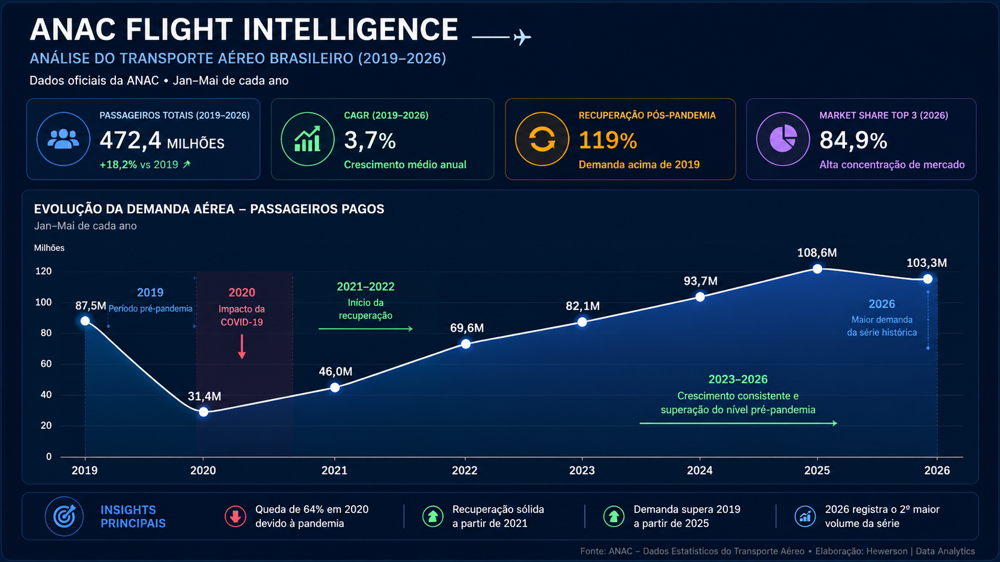
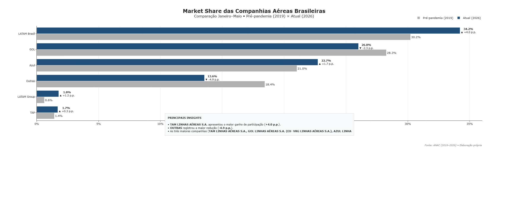

# ✈️ ANAC Flight Intelligence

## Executive Air Transport Analytics (2019–2026)

> Análise exploratória do transporte aéreo brasileiro utilizando dados oficiais da Agência Nacional de Aviação Civil (ANAC).

Este projeto foi desenvolvido como parte dos meus estudos em **Data Science**, aplicando técnicas de análise de dados, visualização e storytelling para transformar dados públicos em informações estratégicas.

Meu objetivo é desenvolver projetos práticos para fortalecer meu portfólio e buscar oportunidades como **Analista de Dados** ou **Analista de BI Júnior**, colocando em prática conhecimentos em Python, SQL, Power BI e visualização de dados.

---

# 📊 Dashboard Executivo

<p align="center">
    
</p>

---

# 📌 Objetivos do Projeto

Este projeto busca responder perguntas de negócio utilizando dados oficiais da ANAC:

- Como evoluiu a demanda aérea brasileira entre 2019 e 2026?
- O setor já recuperou completamente os níveis pré-pandemia?
- Como mudou o Market Share das principais companhias aéreas?
- O mercado tornou-se mais concentrado após a pandemia?
- Quais tendências podem ser observadas na recuperação do setor?

---

# 📈 Principais Indicadores (KPIs)

- ✈️ Passageiros Transportados
- 📊 CAGR (Taxa Média de Crescimento)
- 📈 Recuperação Pós-Pandemia
- 🥇 Market Share das Companhias
- 📌 Concentração das 3 maiores empresas
- 📅 Evolução da Demanda Aérea

---

# 🛠 Tecnologias Utilizadas

- Python
- Pandas
- NumPy
- Plotly
- Jupyter Notebook
- Kaleido

---

# 📂 Estrutura do Projeto

```text
ANAC-Flight-Intelligence/
│
├── assets/
│   ├── anac-executive-dashboard.png
│   └── market-share-comparison-2019-2026.png
│
├── data/
│
├── notebooks/
│   └── analise_anac_2019_2026.ipynb
│
├── README.md
├── requirements.txt
└── LICENSE
```

---

# 📊 Market Share das Companhias Aéreas

Comparação da participação de mercado das principais companhias aéreas brasileiras entre o período pré-pandemia (Jan–Mai/2019) e o cenário atual (Jan–Mai/2026).

<p align="center">
    
</p>

---

# 💡 Principais Insights

- O transporte aéreo brasileiro recuperou completamente os níveis pré-pandemia.
- Em 2026, a demanda supera o volume registrado em 2019.
- A LATAM Brasil ampliou sua participação de mercado no período analisado.
- A GOL apresentou redução de Market Share em relação ao período pré-pandemia.
- O mercado continua altamente concentrado, com as três maiores companhias respondendo por aproximadamente **85%** da demanda.

---

# 📚 Fonte dos Dados

Todos os dados utilizados neste projeto são públicos e disponibilizados pela:

**Agência Nacional de Aviação Civil (ANAC)**

Base utilizada:

- Dados Estatísticos do Transporte Aéreo Brasileiro (2019–2026)

---

# 🚀 Como executar

```bash
git clone https://github.com/SEU-USUARIO/ANAC-Flight-Intelligence.git

cd ANAC-Flight-Intelligence

pip install -r requirements.txt

jupyter notebook
```

Abra o notebook:

```text
notebooks/analise_anac_2019_2026.ipynb
```

---

# 👨‍💻 Sobre mim

Sou estudante de **Data Science** e estou desenvolvendo projetos práticos para aprimorar minhas habilidades em análise de dados, visualização e Business Intelligence.

Atualmente busco oportunidades para adquirir experiência profissional, contribuir com projetos reais e continuar evoluindo na área de Dados.

Se tiver sugestões, feedback ou quiser trocar experiências, fique à vontade para entrar em contato.

---

⭐ Se este projeto foi interessante para você, deixe uma estrela no repositório!
